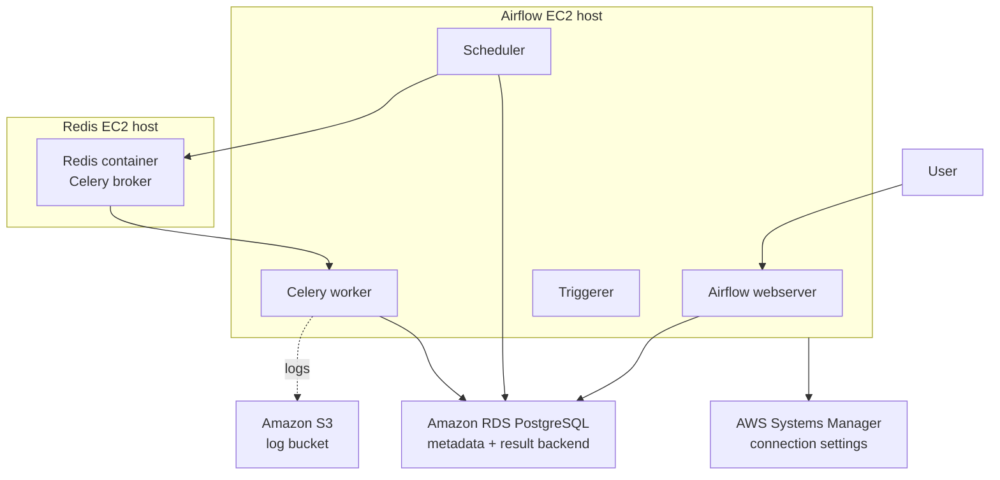

# Airflow Celery Deployment Project

## Overview

This project demonstrates a distributed Apache Airflow development environment on AWS using **CeleryExecutor**, Docker Compose, and Terraform.

Terraform provisions the AWS infrastructure, while Docker Compose defines the Airflow and Redis containers that run on the provisioned EC2 hosts. Airflow uses Amazon RDS for metadata and Celery results, Redis as its task broker, AWS Systems Manager Parameter Store for connection settings, and Amazon S3 as the intended remote-log store.

> **Scope:** This repository is a development/reference deployment. The Docker Compose configuration is based on Airflow's development setup and requires additional hardening before production use.

- **Airflow image:** `apache/airflow:2.10.5`
- **Executor:** `CeleryExecutor`
- **Metadata database and result backend:** Amazon RDS for PostgreSQL
- **Message broker:** Redis 7.2 running in Docker on a dedicated EC2 host
- **Infrastructure as code:** Terraform
- **Configuration storage:** AWS Systems Manager Parameter Store

## Architecture



### Provisioning and runtime responsibilities

| Layer | Responsibility |
|---|---|
| Terraform | Creates the VPC and subnets, two EC2 instances, RDS PostgreSQL, security groups, IAM/instance-profile resources, SSM parameters, and an S3 bucket. |
| Airflow EC2 host | Runs the Airflow webserver, scheduler, Celery worker, triggerer, and initialization containers defined by Docker Compose. |
| Redis EC2 host | Hosts the Redis Docker container used as the Celery message broker. |
| Amazon RDS | Stores Airflow metadata and Celery task results. |
| AWS SSM Parameter Store | Stores the broker URL, SQLAlchemy connection string, and Celery result-backend connection string. |

### Redis implementation

Terraform creates a dedicated EC2 instance for the Redis broker and writes that instance's address into the Airflow broker URL stored in SSM. Docker Compose runs and manages the `redis:7.2-bookworm` container on that host.

This separation is intentional:

1. Terraform provisions the host and network resources.
2. Docker Compose starts and manages the Redis process on that host.
3. Airflow workers retrieve the broker connection details from SSM.

## Repository Structure

```text
.
├── airflow/
│   ├── dags/                 # Example Airflow DAGs
│   ├── docker-compose.yaml   # Airflow and Redis services
│   ├── Dockerfile            # Custom Airflow image
│   └── load_env_variables.sh # Loads configuration from SSM
├── terraform/
│   ├── ec2.tf                # Airflow and Redis EC2 hosts
│   ├── iam.tf                # IAM roles and policies
│   ├── rds.tf                # PostgreSQL metadata database
│   ├── vpc.tf                # VPC, subnets, routes, and gateway
│   ├── ssm.tf                # Airflow connection parameters
│   └── s3.tf                 # Airflow log bucket
└── readme.md
```

## Prerequisites

- Terraform 1.5 or later
- An AWS account and AWS CLI credentials with the required permissions
- Docker and Docker Compose on the target EC2 hosts
- Python 3.10 or later for local testing

## Deployment

### 1. Clone the repository

```bash
git clone https://github.com/DamilolaAdeniji/airflow_celery_deployment_project.git
cd airflow_celery_deployment_project
```

### 2. Provision the AWS infrastructure

```bash
cd terraform
terraform init
terraform plan
terraform apply
```

This creates the AWS networking, Airflow and Redis EC2 hosts, RDS PostgreSQL instance, IAM resources, SSM parameters, security groups, and S3 bucket. Terraform creates the Redis **host**; Docker Compose starts the Redis **service**.

### 3. Load Airflow configuration

On the Airflow EC2 host, move into the Airflow directory and load the values stored in SSM:

```bash
cd airflow_celery_deployment_project/airflow
chmod +x load_env_variables.sh
./load_env_variables.sh
```

### 4. Start Redis

On the Redis EC2 host:

```bash
cd airflow_celery_deployment_project/airflow
docker compose up -d redis
docker compose ps
```

### 5. Start Airflow

On the Airflow EC2 host:

```bash
cd airflow_celery_deployment_project/airflow
docker compose up airflow-init
docker compose up -d airflow-webserver airflow-scheduler airflow-worker airflow-triggerer
docker compose ps
```

## Verification

The repository includes the manually triggered `three_python_sleep_tasks` DAG. It runs three sequential Python tasks and provides a simple check that the scheduler, Redis broker, Celery worker, and metadata database can communicate.

1. Open the Airflow UI at `http://<airflow-ec2-address>:8081`.
2. Enable and trigger `three_python_sleep_tasks`.
3. Confirm that `sleep_1`, `sleep_2`, and `sleep_3` finish successfully.
4. Confirm worker availability:

```bash
docker compose exec airflow-worker   celery --app airflow.providers.celery.executors.celery_executor.app inspect ping
```

5. Confirm service health:

```bash
docker compose ps
```

